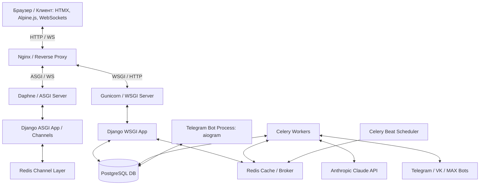

# Шпаргалка для защиты проекта «Строка» (Bookopolis)

Эта шпаргалка создана специально для защиты проекта перед комиссией. Вопросы на защите обычно касаются конкретных механизмов реализации, архитектурных решений и подходов к безопасности. Здесь собраны подробные технические ответы на самые каверзные вопросы.

---

## 1. ОБЩАЯ АРХИТЕКТУРА И СТЕК ТЕХНОЛОГИЙ



### Главные компоненты стека:
1. **Backend:** Django 5 (бизнес-логика, ORM, администрирование).
2. **База данных:** PostgreSQL (основное реляционное хранилище, полнотекстовый поиск FTS).
3. **Кэш и Брокер:** Redis 7 (кэширование рекомендаций и IDF-весов, брокер задач Celery, Channel Layer для WebSockets).
4. **Фоновые задачи:** Celery + Celery Beat (асинхронные вычисления, периодические задачи).
5. **Real-time:** Django Channels (асинхронная обработка WebSockets поверх протокола ASGI).
6. **Фронтенд:** Django Templates + HTMX + Alpine.js (интерактивный интерфейс «печатной машинки» без тяжелых JS-сборщиков вроде Webpack/Vite).
7. **Внешние интеграции:** Anthropic Claude API (AI-функции), Telegram Bot API, VK Bot, MAX Bot.

---

## 2. РЕАЛИЗАЦИЯ REST API И БЕЗОПАСНОСТЬ КЛЮЧЕЙ

### **В: На чём написан API сайта и как устроена авторизация?**
**О:** REST API реализован с использованием фреймворка **Django REST Framework (DRF)**. Интерактивная документация (Swagger UI и ReDoc) автоматически генерируется пакетом **drf-spectacular** по стандарту OpenAPI 3.

Авторизация внешних клиентов происходит по **API-ключам**.
1. Пользователь (или администратор) создаёт ключ в дашборде (`/public_api/dashboard/`).
2. Генерируется случайный криптостойкий токен с префиксом: `sk_stroka_<32_random_bytes>` (с использованием модуля `secrets` в Python).
3. **Безопасность:** В базе данных (модель `ApiKey` в приложении `public_api`) **никогда не хранится сам ключ в открытом виде**. Мы храним только его SHA-256 хэш (`key_hash`) и префикс (`prefix` — первые 12 символов для идентификации ключа в интерфейсе). Если база данных будет скомпрометирована, злоумышленник не сможет восстановить действующие ключи.
4. При запросе клиент передает ключ в заголовке `Authorization: Bearer <key>` или в кастомном заголовке `X-API-Key`.

### **В: Покажи класс аутентификации API в коде.**
**О:** В файле `public_api/auth.py` реализован класс `ApiKeyAuthentication`, наследуемый от `rest_framework.authentication.BaseAuthentication`:
* Метод `authenticate(self, request)` извлекает сырой ключ из заголовков.
* Хэширует его с помощью `hashlib.sha256(raw_key.encode("utf-8")).hexdigest()`.
* Ищет активный ключ в БД по хэшу: `ApiKey.objects.filter(key_hash=hash, is_active=True).select_related('owner').first()`.
* Если ключ найден, возвращает кортеж `(user, api_key)`.
* Дополнительно для каждой сессии пишется лог запросов в модель `ApiRequestLog` (логируется путь, HTTP-метод, IP-адрес клиента, User-Agent и время задержки в миллисекундах `latency_ms`).

---

## 3. РЕАЛИЗАЦИЯ REAL-TIME ОБЩЕНИЯ (WEBSOCKETS)

### **В: Как устроена работа с WebSocket на сервере и клиенте?**
**О:** 
* **Серверная часть:** Проект работает в режиме **ASGI** (Асинхронный серверный интерфейс). Для маршрутизации соединений в `config/asgi.py` используется `ProtocolTypeRouter`. HTTP-запросы идут на стандартный Django WSGI, а WebSocket-запросы перехватываются `AuthMiddlewareStack` и направляются на `URLRouter(websocket_urlpatterns)`.
* **Маршрутизация:** Все WebSocket соединения на адрес `ws/chat/<room_id>/` обрабатывает асинхронный потребитель `ChatConsumer(AsyncWebsocketConsumer)` в файле `chat/consumers.py`.
* **Связующее звено (Channel Layer):** Для пересылки сообщений между разными процессами (например, если два пользователя сидят на разных инстансах приложения) используется **Redis Channel Layer** (`channels_redis.core.RedisChannelLayer`).

### **В: Как устроена безопасность WebSocket-соединений? Защищены ли чаты от несанкционированного доступа?**
**О:** Да, безопасность реализована на уровне подключения в методе `connect()` класса `ChatConsumer`:
1. Сессия пользователя извлекается из Django-сессии с помощью `AuthMiddlewareStack`. Объект пользователя доступен в `self.scope["user"]`.
2. Если пользователь анонимен (`user.is_anonymous`), соединение немедленно сбрасывается (`self.close()`).
3. Далее вызывается асинхронная проверка прав доступа к комнате:
   ```python
   is_participant = await self._is_participant(user.pk, self.room_id)
   if not is_participant:
       await self.close()
       return
   ```
   Метод `_is_participant` обернут в декоратор `@database_sync_to_async` для безопасного выполнения синхронных SQL-запросов к PostgreSQL из асинхронного контекста. Он проверяет существование записи в связующей таблице `ChatParticipant`.
4. Только после прохождения всех проверок вызывается `self.channel_layer.group_add(...)` (добавление канала в группу комнаты) и `self.accept()` (подтверждение хэндшейка).

### **В: Опиши жизненный цикл отправки сообщения в чат.**
**О:**
1. **Клиент** (браузер) отправляет JSON-пакет по открытому сокету: `ws.send(JSON.stringify({body: "Привет", book_id: null}))`.
2. На **сервере** срабатывает асинхронный метод `receive(self, text_data)`:
   * Парсит JSON. Поддерживает текстовые сообщения, прикрепление книг и статус «печатает...» (`typing`).
   * Сохраняет сообщение в БД через метод `_save_message` (вызывается асинхронно через `@database_sync_to_async`). В процессе сохранения текст сообщения прогоняется через парсер `linkify_message_text` для преобразования URL в кликабельные HTML-ссылки и автоупоминаний.
   * Если в тексте есть упомянутые пользователи (`@username`), метод `_notify_mentions` извлекает их с помощью регулярного выражения `MENTION_RE`, проверяет, что они состоят в этом чате, и делает массовую запись `bulk_create` инбокс-уведомлений в модель `Notification`.
   * Рассылает сообщение группе комнаты через Channel Layer: `self.channel_layer.group_send(self.group_name, {"type": "chat_message", ...})`.
3. Все клиенты, подписанные на эту группу в Redis, получают событие через метод `chat_message(self, event)`, который отправляет готовый JSON обратно на фронтенд клиента с помощью `self.send(...)`.
4. На **фронтенде** (в файле `chat/templates/chat/chat_room.html`):
   * Срабатывает событие `ws.onmessage`.
   * JS парсит JSON и динамически добавляет новый HTML-шаблон сообщения в блок `#chat-messages` (включая аватар пользователя, градиентную подложку, текст сообщения и карточку прикрепленной книги).
   * Автоматически прокручивает скролл вниз.
   * В случае дисконнекта срабатывает `ws.onclose`, который через таймаут в 2 секунды пытается переподключить сокет (`connectWS()`), обеспечивая отказоустойчивость.

---

## 4. РЕКОМЕНДАТЕЛЬНАЯ СИСТЕМА (АЛГОРИТМИЧЕСКИЙ + AI ПОДХОД)

Комиссия очень любит вопросы про рекомендательные системы. В данном проекте реализован мощный гибридный подход:

```
[Модели книг и жанров] ──> [1. Алгоритмический отбор (IDF жанров, вес авторов)] ──> [50 кандидатов]
                                                                                            │
[Профиль пользователя] ──> [3. Взвешивание вкуса по Sentiment (TF-IDF)]                     │
                                                                                            ▼
[Anthropic Claude API] <── [2. Двухэтапный AI-Pipeline (Ранжирование, tool_use)] <──────────┘
```

### **В: Как алгоритмически высчитывается схожесть книг?**
**О:** На основе взвешенного скоринга по метаданным (метод `similar_books`):
* `+4 балла` за каждого совпадающего автора.
* `+3 балла × IDF жанра`. Мы используем формулу **IDF (Inverse Document Frequency)** для жанров: редкие жанры (например, «Киберпанк») имеют высокий вес, а массовые (например, «Проза») — низкий. Веса кэшируются в Redis на 1 час для исключения тяжелых SQL-запросов.
* `+2 балла` если книги входят в одну серию.
* `+1 балл` если год издания отличается не более чем на 5 лет.
* `+0.5 × avg_rating` в качестве бонуса за высокое среднее качество книги.

### **В: Что такое «Также читают» (also_read)?**
**О:** Это **Item-based коллаборативная фильтрация**. Мы находим пользователей, у которых текущая книга добавлена в списки с **положительным** sentiment-тегом (`positive` или `wishlist`). Затем смотрим, какие ещё книги эти пользователи добавляли в свои положительные списки, агрегируем их по частоте упоминаний и исключаем уже прочитанные текущим пользователем книги. Списки с тегом `negative` игнорируются, чтобы не рекомендовать некачественный контент.

### **В: Как устроен персональный подбор для конкретного пользователя (recommended_for_user)?**
**О:** 
1. Строится **профиль вкуса пользователя**: собираются все авторы и жанры из его списков книг.
2. Вкусы взвешиваются в зависимости от отношения пользователя к книге (`sentiment_tag` списка): `positive = 1.0`, `wishlist = 0.6`, `neutral = 0.4`, а за книги из списков `negative` накладывается штраф `-0.5`. Также учитывается оценка из отзывов пользователя.
3. Применяется **TF-IDF скоринг**: интересы пользователя накладываются на каталог книг, вычисляя косинусное сходство или взвешенную сумму характеристик, чтобы сформировать список из 50 наиболее подходящих кандидатов.

### **В: Зачем в рекомендациях нужен AI (Claude) и как вы защитились от галлюцинаций LLM?**
**О:** Алгоритмический метод собирает 50 релевантных кандидатов из базы данных, но не может оценить глубокий контекст (синопсис книги, стиль автора, сложные пожелания пользователя). Для финального ранжирования мы отправляем эти 50 кандидатов в **Anthropic Claude API** (модель Haiku).
* **Защита от галлюцинаций (Критически важно):** Мы **не просим** модель назвать случайные книги из её внутренней памяти или вернуть ID книг из нашей базы. Вместо этого мы передаем список кандидатов с их порядковыми номерами от 0 до 49 (синопсис + авторы + жанры) и просим модель вернуть массив индексов победителей. Поскольку Claude оперирует только предоставленным массивом индексов, она физически не может выдумать несуществующую книгу или подставить чужой Primary Key.
* **Структурированный вывод:** Используется технология `tool_use` (функции API). Мы принудительно навязываем JSON-схему ответа, гарантируя, что на выходе будет строго типизированный JSON со списком индексов и текстовыми объяснениями рекомендаций (`reason_bullets`).
* **Экономия и скорость:** Результаты персональных AI-рекомендаций кэшируются в Redis на 24 часа.

---

## 5. ФОНОВЫЕ ЗАДАЧИ И ПАРСИНГ (CELERY & CELERY BEAT)

### **В: Зачем в проекте Celery и как он работает?**
**О:** Celery используется как распределенная очередь задач для выполнения тяжелых асинхронных операций вне основного HTTP-потока (чтобы сайт не зависал во время ожидания внешних API или долгих расчетов).
* **Брокер:** Redis (`redis://localhost:6379/0`).
* **Планировщик:** Celery Beat с динамическим планировщиком `DatabaseScheduler` (позволяет настраивать расписание прямо из Django админки).

### **В: Какие именно задачи вынесены в фоновые процессы?**
**О:**
1. **Парсинг цен книг (`scrape_book_prices`):** Запускается асинхронно по запросу пользователя. Запрос к сайтам книжных магазинов делается через библиотеку `BeautifulSoup` и `requests`. Селекторы цен для каждого магазина хранятся в БД (админка), что позволяет менять логику парсинга без перезапуска кода. Для защиты от спама на кнопку парсинга наложена Google reCAPTCHA v2.
2. **Алерты на снижение цен:** Celery Beat каждое утро в 09:00 запускает задачу, которая проверяет активные алерты пользователей (`PriceAlert`). Если текущая распарсенная цена книги падает ниже порога, установленного пользователем, генерируется уведомление.
3. **AI-автотегирование книг (`extract_tags_from_description`):** При добавлении книги Celery асинхронно отправляет её описание в Claude для извлечения 3 ключевых mood-тегов (атмосфера, стиль, темп).
4. **AI-классификация списков (`classify_list_sentiment`):** При создании пользовательского списка книг Claude анализирует его название и автоматически выставляет тег: `positive`, `negative`, `neutral` или `wishlist`.
5. **AI-анализ читалки:** Саммаризация глав, семантический поиск по фрагментам текста книги, выделение умных цитат и определение стиля автора.

---

## 6. ИНТЕГРАЦИЯ С МЕССЕНДЖЕРАМИ (TELEGRAM-БОТ)

### **В: Как устроен ваш Telegram-бот и как вы связали его с сайтом?**
**О:** Бот написан на современном асинхронном фреймворке **aiogram v3** (запускается как отдельный фоновый демон `python telegram_bot.py` или в отдельном Docker-контейнере).
* **Интеграция с ORM:** В начале файла бота вызывается:
  ```python
  os.environ.setdefault("DJANGO_SETTINGS_MODULE", "config.settings")
  django.setup()
  ```
  Это позволяет боту напрямую использовать Django ORM, работать с моделями базы данных и проверять пароли пользователей стандартными методами Django Auth.
* **Безопасная авторизация (`/start`):** 
  1. Бот запрашивает у пользователя логин и пароль от сайта.
  2. Пароль сверяется через стандартную функцию `django.contrib.auth.authenticate`.
  3. **Безопасность:** Чтобы пароли не утекали и не висели в истории чата Telegram, бот **немедленно удаляет** сообщение с паролем из чата с помощью метода `message.delete()`.
  4. При успешной аутентификации бот сохраняет `chat_id` пользователя в его профиль `UserProfile.telegram_chat_id`.
* **Отправка уведомлений:** При наступлении событий (например, выход новой книги у автора, на которого подписан пользователь, или срабатывание алерта цены) Celery-задача вызывает вспомогательный модуль `notifications/telegram.py`. Он делает простой, легковесный POST-запрос к Telegram Bot API через библиотеку `requests` (без надобности инициализировать тяжемый `aiogram` внутри Celery-воркера).

---

## 7. ОПТИМИЗАЦИЯ ПРОИЗВОДИТЕЛЬНОСТИ И БД

Комиссия ценит разработчиков, умеющих оптимизировать SQL-запросы.

### **В: Как вы боролись с проблемой N+1 запросов при работе с ORM?**
**О:** Проблема N+1 возникает, когда при выборке списка книг Django для каждой книги делает отдельный SQL-запрос для получения связанных авторов или жанров. Мы решили это через жадную загрузку данных (Eager Loading):
* `select_related('publisher', 'language')` — для связей типа One-to-Many / ForeignKey (генерирует SQL `INNER JOIN` на уровне СУБД).
* `prefetch_related('authors', 'genres')` — для связей типа Many-to-Many (делает 2 дополнительных эффективных запроса с оператором `IN` и склеивает данные в оперативной памяти Python).
* Пример из `BookViewSet`:
  ```python
  queryset = Book.objects.select_related("publisher", "language").prefetch_related("authors", "genres")
  ```

### **В: Какая денормализация базы данных была проведена?**
**О:** Для повышения скорости работы каталога и главной страницы мы применили **денормализацию** данных в модели `Book`:
* Вместо того чтобы при каждом открытии страницы высчитывать среднюю оценку книги через агрегатные функции SQL (`AVG('reviews__rating')`), мы храним посчитанное значение в поле `avg_rating` и общее количество отзывов в `rating_count`.
* То же самое сделано для минимальной/средней цены (`avg_price`).
* Пересчёт этих полей происходит асинхронно через сигналы Django (`post_save` / `post_delete` на моделях отзывов и цен). Это снижает нагрузку на базу данных при чтении в сотни раз.

### **В: Какие индексы созданы в СУБД?**
**О:** Индексы созданы на полях, по которым наиболее часто происходят поиск, фильтрация или джоины:
* Уникальный индекс на хэш API-ключа (`key_hash`).
* Индекс на префикс ключа (`prefix`) для быстрой сверки.
* Индекс на поле даты создания логов `created_at` (`db_index=True`), так как логи сортируются по убыванию даты.
* Полнотекстовые индексы PostgreSQL для поиска по названиям и описаниям книг (`search`).

---

## 8. УСТРОЙСТВО СИСТЕМЫ «ДИАЛОГ» (CHATS & AI CHATS)

В проекте функционируют три типа диалогов, решающих разные задачи:

```
                  ┌───────────────────────────────┐
                  │       Типы Диалогов           │
                  └───────────────┬───────────────┘
                                  │
         ┌────────────────────────┼────────────────────────┐
         ▼                        ▼                        ▼
┌──────────────────┐    ┌──────────────────┐    ┌──────────────────┐
│   Real-time DM   │    │   AI Book Chat   │    │  Discovery Chat  │
│  и групповые чаты│    │   (Чат с книгой) │    │(Поиск по синопсису)│
└──────────────────┘    └──────────────────┘    └──────────────────┘
```

### 1. Real-time диалоги пользователей (Direct Messages & Club Chats)
* **Задачи:** Общение тет-а-тет между друзьями (DM) и обсуждения в клубах (групповые чаты и ветки обсуждения книг).
* **Стек:** **Django Channels** (WebSockets) + **Redis Channel Layer**.
* **Интерактив:** Поддержка статуса ввода текста (`typing`), редактирования сообщений (`chat_edit`), эмодзи-реакций (`chat_reaction`) и прикрепления карточек книг.
* **Автоуведомления:** При вводе сообщения с `@username` регулярка находит участников чата и создает для них `Notification` (kind=mentioned).

### 2. Чат с книгой (AI Book Chat)
* **Задача:** Обсуждение конкретной книги с искусственным интеллектом (например, ответы на вопросы по сюжету, стилю автора, саммаризация глав).
* **Модели:** `BookChat` (связь `User` и `Book`) и `BookChatMessage` (история диалога с ролями `user` и `assistant`).
* **Асинхронность (Celery):** Поскольку генерация ответа от LLM занимает время (до 5–10 секунд), HTTP-запрос от пользователя не блокирует поток. 
  1. Пользователь отправляет сообщение через HTMX.
  2. Вьюшка `book_chat_send` запускает фоновую задачу Celery `book_chat_send_task.delay()`.
  3. Клиент переходит в режим ожидания (Polling) с помощью HTMX-триггера `hx-trigger="every 1.5s"`, опрашивая статус задачи в `book_chat_status`.
  4. Как только Celery-воркер получает ответ от Claude API и сохраняет его в БД, статус задачи меняется на `SUCCESS`, и HTMX заменяет индикатор загрузки готовым ответом AI.

### 3. Диалог поиска (AI Discovery Chat)
* **Задача:** Помощь в поиске книг на основе текстового описания предпочтений пользователя («Посоветуй атмосферный детектив в стиле нуар в дождливом Лондоне»).
* **Модели:** `DiscoveryChat` и `DiscoveryChatMessage` (содержит историю, привязанные рекомендации в Many-to-Many `recommended_books` и метаданные в JSONField `books_meta`).
* **Как устроен Discovery-движок (`ai_chat/discovery_engine.py`):**
  * **Контекст диалога:** LLM помнит историю переписки.
  * **Follow-up опции:** Движок генерирует интерактивные «чипсы» (быстрые ответы) в поле `followup_options` (например, «Сделать акцент на динамике» или «Добавить мистику»), которые пользователь может нажать для уточнения запроса.
  * **Сохранение в списки:** Уникальная фича — пользователь может сохранить выданные AI рекомендации в виде готового книжного списка одной кнопкой (`save_last_recommendations_as_list`).

---

## 9. УСТРОЙСТВО СИСТЕМЫ «УВЕДОМЛЕНИЯ» (NOTIFICATIONS)

Система уведомлений состоит из двух независимых частей: внутренняя лента (Inbox) и внешние каналы (Telegram, VK, MAX).

```
                      ┌────────────────────────┐
                      │    Входящее событие    │
                      └───────────┬────────────┘
                                  │
         ┌────────────────────────┴────────────────────────┐
         ▼                                                 ▼
┌──────────────────┐                              ┌──────────────────┐
│ Внутренний Inbox │                              │  Внешние каналы  │
│    (База Данных) │                              │ (Фоновые задачи) │
└────────┬─────────┘                              └────────┬─────────┘
         │                                                 │
         ▼                                  ┌──────────────┼──────────────┐
  [HTMX Polling]                            ▼              ▼              ▼
  (Каждые 10 сек)                     [Telegram]          [VK]          [MAX]
                                    (aiogram/reqs)      (requests)    (requests)
```

### 1. Внутренний Inbox (Лента событий в БД)
* **Базовая модель:** `Notification` в приложении `notifications`. 
* **Полиморфизм через Generic Relations:** Для гибкости уведомление может ссылаться на любую сущность (Книгу, Рецензию, Чат, Заявку в друзья) с помощью механизма `GenericForeignKey` (поля `target_content_type` и `target_object_id`).
* **Типизация:** Поле `kind` содержит тип события (`new_message`, `friend_request`, `book_recommended`, `mentioned` и др.).
* **Интерфейс:**
  * Уведомления группируются по категориям (социальные, системные, книги, сообщения).
  * **Реализация бейджа в шапке (HTMX Polling):** Количество непрочитанных уведомлений обновляется без WebSockets — с помощью лёгкого периодического HTMX-запроса в шапке:
    ```html
    <div hx-get="" hx-trigger="every 10s" hx-swap="outerHTML">
    ```
    Это существенно экономит ресурсы сервера и не держит открытыми сотни WebSocket-соединений только ради счётчика.

### 2. Внешние каналы (Telegram, VK, MAX)
* **Настройки пользователя (`NotificationSetting`):** В БД хранится матрица настроек для каждого пользователя — какие категории событий отправлять в какие каналы (например: «Новые книги автора слать в Telegram и Inbox, а комментарии — только в Inbox»).
* **Асинхронная отправка:** Все уведомления отправляются через Celery-задачу `notify_book_added` (или аналогичные).
* **Связывание аккаунта (Telegram):**
  1. Бот (`telegram_bot.py` на `aiogram v3`) запрашивает логин/пароль.
  2. Вызывает `django.contrib.auth.authenticate`.
  3. Для безопасности сообщение с паролем немедленно удаляется (`message.delete()`).
  4. В `UserProfile` пользователя прописывается его `telegram_chat_id`.
* **Доставка без оверхеда:** Чтобы Celery-воркеру не нужно было держать запущенный движок `aiogram`, отправка сообщений в `notifications/telegram.py` реализована в виде лёгкой обёртки над API:
  ```python
  requests.post("https://api.telegram.org/bot<token>/sendMessage", json={"chat_id": chat_id, "text": text})
  ```
  Аналогичным образом реализована отправка через API VK и MAX.

