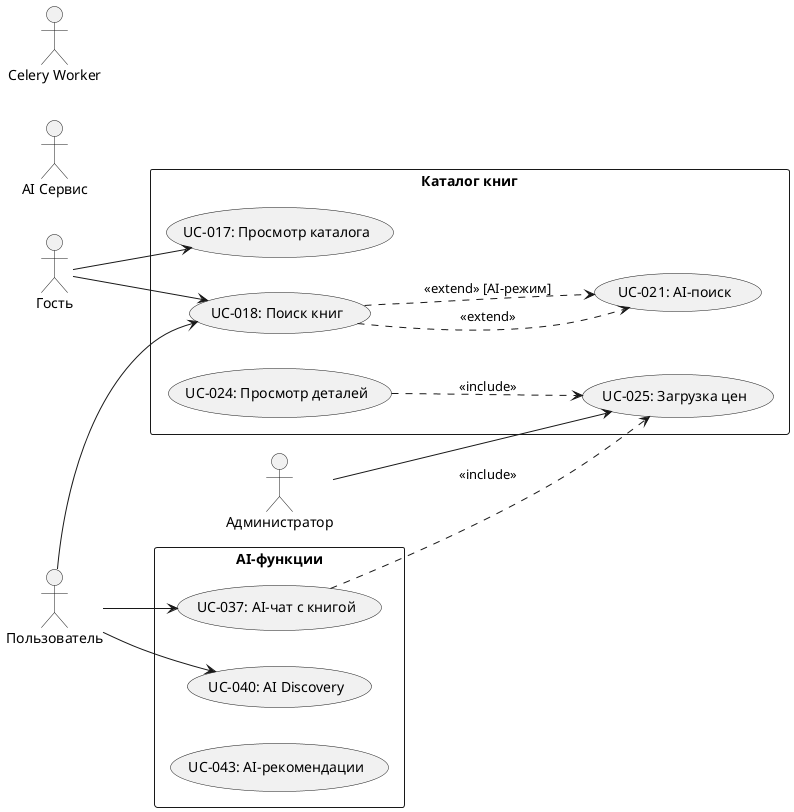

# Use Case Diagram Specification — Проект «Строка» (Bookopolis)

## 1. Акторы (Actors)

### 1.1 Гость (Guest)
- Неавторизованный посетитель сайта
- Может просматривать каталог, читать рецензии, использовать базовый поиск

### 1.2 Пользователь (User)
- Авторизованный пользователь с аккаунтом
- Имеет доступ к персонализированным функциям: списки книг, рецензии, AI-чат, социальные функции

### 1.3 Администратор (Admin)
- Staff-пользователь с расширенными правами
- Модерирует контент, управляет пользователями, настраивает систему

### 1.4 AI Сервис (AIService)
- Внешняя система (OpenRouter API)
- Обрабатывает AI-запросы: рекомендации, саммари, чат, анализ книг

### 1.5 Celery Worker (BackgroundWorker)
- Фоновый обработчик задач
- Выполняет асинхронные операции: парсинг цен, рассылки уведомлений

---

## 2. Use Cases и связи

### 2.1 Модуль: Аутентификация и регистрация

**UC-001: Регистрация пользователя**
- Акторы: Гость
- Описание: Создание нового аккаунта с username, email, password
- Связи:
  - include UC-002 (Email верификация)
  - include UC-003 (Проверка reCAPTCHA)

**UC-002: Email верификация**
- Акторы: Система (Resend API)
- Описание: Отправка письма с подтверждением email
- Триггер: Всегда включается при регистрации

**UC-003: Проверка reCAPTCHA**
- Акторы: Система (Google API)
- Описание: Защита от ботов при регистрации

**UC-004: Вход в систему**
- Акторы: Гость
- Описание: Аутентификация существующего пользователя
- Связи:
  - extend UC-005 (Блокировка аккаунта) — если пользователь заблокирован

**UC-005: Блокировка аккаунта**
- Акторы: Администратор
- Описание: Временная или постоянная блокировка пользователя
- Условие расширения: Применяется при попытке входа заблокированного пользователя

**UC-006: Сброс пароля**
- Акторы: Гость, Пользователь
- Описание: Восстановление доступа через email

**UC-007: Выход из системы**
- Акторы: Пользователь
- Описание: Завершение сессии

---

### 2.2 Модуль: Профиль пользователя

**UC-008: Редактирование профиля**
- Акторы: Пользователь
- Описание: Изменение аватара, био, контактов (Telegram, MAX, VK)

**UC-009: Управление списками книг**
- Акторы: Пользователь
- Описание: Создание, удаление, редактирование пользовательских списков
- Связи:
  - include UC-010 (Обновление списка книг)

**UC-010: Обновление списка книг**
- Акторы: Пользователь
- Описание: Добавление/удаление книг в список

**UC-011: Импорт библиотеки**
- Акторы: Пользователь
- Описание: Загрузка списков книг из внешних источников (CSV/JSON)

**UC-012: Экспорт списков**
- Акторы: Пользователь
- Описание: Выгрузка списков в CSV или JSON

**UC-013: Просмотр статистики чтения**
- Акторы: Пользователь
- Описание: Просмотр статистики: прочитано книг, страниц, топ жанров
- Связи:
  - extend UC-014 (Получение достижений) — при достижении порогов

**UC-014: Получение достижений**
- Акторы: Система
- Описание: Начисление ачивок за активность
- Условие расширения: Срабатывает при изменении статистики

**UC-015: Управление приватными заметками**
- Акторы: Пользователь
- Описание: Создание, просмотр, удаление заметок к книгам

**UC-016: Подписка на автора**
- Акторы: Пользователь
- Описание: Получение уведомлений о новых книгах автора

---

### 2.3 Модуль: Каталог и поиск книг

**UC-017: Просмотр каталога**
- Акторы: Гость, Пользователь
- Описание: Просмотр списка книг с фильтрами и сортировкой

**UC-018: Поиск книг**
- Акторы: Гость, Пользователь
- Описание: Текстовый поиск по названию, автору, жанру, описанию
- Связи:
  - include UC-019 (Автокомплит поиска)
  - include UC-020 (Сохранение в историю поиска)
  - extend UC-021 (AI-поиск) — при выборе AI-режима

**UC-019: Автокомплит поиска**
- Акторы: Система
- Описание: Подсказки при вводе поискового запроса

**UC-020: Сохранение в историю поиска**
- Акторы: Система
- Описание: Сохранение последних 15 уникальных запросов пользователя

**UC-021: AI-поиск (семантический)**
- Акторы: AI Сервис
- Описание: Поиск книг по смыслу запроса через LLM

**UC-022: Фильтрация книг**
- Акторы: Гость, Пользователь
- Описание: Фильтрация по жанрам, авторам, году, цене, рейтингу
- Связи:
  - include UC-023 (Применение пресетов фильтров)

**UC-023: Применение пресетов фильтров**
- Акторы: Система
- Описание: Быстрый выбор: Новинки, Популярные, Топ-рейтинг, Классика

**UC-024: Просмотр деталей книги**
- Акторы: Гость, Пользователь
- Описание: Просмотр полной информации о книге: описание, цены, отзывы
- Связи:
  - include UC-025 (Загрузка актуальных цен) — при отсутствии свежих данных

**UC-025: Загрузка актуальных цен**
- Акторы: Celery Worker
- Описание: Фоновый парсинг цен из магазинов

**UC-026: Установка алерта на цену**
- Акторы: Пользователь
- Описание: Настройка уведомления при снижении цены ниже порога

---

### 2.4 Модуль: Отзывы и рецензии

**UC-027: Написать отзыв (Review)**
- Акторы: Пользователь
- Описание: Короткий отзыв с оценкой 1-5 звезд
- Связи:
  - include UC-028 (AI-модерация отзыва)
  - include UC-029 (Извлечение AI-тегов)

**UC-028: AI-модерация отзыва**
- Акторы: AI Сервис
- Описание: Автоматическая проверка на спам и токсичность

**UC-029: Извлечение AI-тегов**
- Акторы: AI Сервис
- Описание: Автоматическое определение тематики отзыва

**UC-030: Написать рецензию (Critique)**
- Акторы: Пользователь
- Описание: Развернутый обзор с критериями оценки, HTML/Markdown редактор
- Связи:
  - include UC-031 (Модерация рецензии)
  - extend UC-032 (Добавление обложки рецензии)

**UC-031: Модерация рецензии**
- Акторы: Система → Администратор (при сложных случаях)
- Описание: Проверка перед публикацией (pending/approved/rejected)

**UC-032: Добавление обложки рецензии**
- Акторы: Пользователь
- Описание: Загрузка изображения для рецензии
- Условие расширения: Опциональная функция

**UC-033: Комментирование рецензии**
- Акторы: Пользователь
- Описание: Добавление комментария к рецензии другого пользователя
- Связи:
  - extend UC-034 (Вложенные ответы) — при ответе на комментарий

**UC-034: Вложенные ответы на комментарии**
- Акторы: Пользователь
- Описание: Reply на существующий комментарий

**UC-035: Голосование за комментарий**
- Акторы: Пользователь
- Описание: Лайк/дизлайк комментария (+1/-1)

**UC-036: Лайк рецензии/отзыва**
- Акторы: Пользователь
- Описание: Отметка "Полезно" на отзыве или рецензии

---

### 2.5 Модуль: AI-функции

**UC-037: AI-чат с книгой**
- Акторы: Пользователь, AI Сервис
- Описание: Персональный диалог об конкретной книге
- Связи:
  - include UC-038 (Асинхронная обработка запроса)
  - include UC-039 (Сохранение истории чата)

**UC-038: Асинхронная обработка запроса**
- Акторы: Celery Worker
- Описание: Отправка запроса в LLM через очередь задач

**UC-039: Сохранение истории чата**
- Акторы: Система
- Описание: Персистентность сообщений между сессиями

**UC-040: AI Discovery Chat (поиск книг через диалог)**
- Акторы: Пользователь, AI Сервис
- Описание: Диалоговый поиск книг по описанию пожеланий
- Связи:
  - include UC-041 (Понимание запроса через LLM)
  - extend UC-042 (Follow-up уточняющий вопрос) — при необходимости уточнений

**UC-041: Понимание запроса через LLM**
- Акторы: AI Сервис
- Описание: Интерпретация запроса в структурированные параметры поиска

**UC-042: Follow-up уточняющий вопрос**
- Акторы: AI Сервис
- Описание: Задавание уточняющих вопросов пользователю
- Условие расширения: При недостаточной конкретности запроса

**UC-043: Получение AI-рекомендаций**
- Акторы: Пользователь, AI Сервис
- Описание: Персонализированные рекомендации с объяснением "почему"
- Связи:
  - include UC-044 (Анализ предпочтений пользователя)

**UC-044: Анализ предпочтений пользователя**
- Акторы: AI Сервис
- Описание: Обработка истории чтения и оценок для рекомендаций

**UC-045: AI-саммари главы книги**
- Акторы: Пользователь, AI Сервис
- Описание: Автоматическое краткое содержание главы
- Связи:
  - extend UC-046 (Семантический поиск по тексту) — при использовании читалки

**UC-046: Семантический поиск по тексту книги**
- Акторы: Пользователь, AI Сервис
- Описание: AI-поиск по содержимому загруженной книги
- Условие расширения: Требуется загруженный текст книги

**UC-047: AI-генерация цитат**
- Акторы: AI Сервис
- Описание: Автоматическое извлечение ключевых цитат из текста книги

**UC-048: AI-анализ стиля автора**
- Акторы: AI Сервис
- Описание: Профиль стиля для рекомендаций похожих книг

---

### 2.6 Модуль: Читалка (EPUB/FB2)

**UC-049: Чтение книги онлайн**
- Акторы: Пользователь
- Описание: Просмотр книги по главам в встроенной читалке
- Предусловие: Книга должна быть в списке пользователя или пользователь — staff
- Связи:
  - include UC-050 (Сохранение прогресса чтения)
  - extend UC-051 (Создание заметки к тексту)

**UC-050: Сохранение прогресса чтения**
- Акторы: Система
- Описание: Запоминание страницы, главы, позиции скролла

**UC-051: Создание заметки к тексту**
- Акторы: Пользователь
- Описание: Выделение фрагмента и добавление примечания

**UC-052: Добавление цитаты из книги**
- Акторы: Пользователь, AI Сервис
- Описание: Сохранение выделенного текста как цитаты
- Связи:
  - extend UC-053 (AI-генерация умных цитат) — для генерации связанных цитат

**UC-053: AI-генерация умных цитат**
- Акторы: AI Сервис
- Описание: AI предлагает релевантные цитаты из книги

**UC-054: Загрузка полного текста книги**
- Акторы: Администратор
- Описание: Загрузка EPUB/FB2 для встроенной читалки
- Связи:
  - include UC-055 (Извлечение глав и структуры)

**UC-055: Извлечение глав и структуры**
- Акторы: Система
- Описание: Парсинг EPUB/FB2 в главы для навигации

---

### 2.7 Модуль: Социальные функции

**UC-056: Управление друзьями**
- Акторы: Пользователь
- Описание: Отправка заявок, принятие, удаление друзей

**UC-057: Рекомендация книги другу**
- Акторы: Пользователь
- Описание: Отправка книги другу с персональным сообщением

**UC-058: Просмотр ленты активности**
- Акторы: Пользователь
- Описание: Лента событий друзей: рецензии, вступление в клубы, новые дружбы

**UC-059: Просмотр публичного профиля**
- Акторы: Гость, Пользователь
- Описание: Просмотр активности, статистики, списков другого пользователя

**UC-060: Просмотр leaderboard**
- Акторы: Гость, Пользователь
- Описание: Рейтинг пользователей по активности

---

### 2.8 Модуль: Книжные клубы

**UC-061: Создание книжного клуба**
- Акторы: Пользователь
- Описание: Создание клуба с настройками приватности
- Связи:
  - include UC-062 (Назначение ролей участников)

**UC-062: Назначение ролей участников**
- Акторы: Владелец клуба
- Описание: Установка ролей: owner, admin, member

**UC-063: Управление участниками клуба**
- Акторы: Администратор клуба
- Описание: Приглашения, удаление, изменение ролей

**UC-064: Присоединение к клубу**
- Акторы: Пользователь
- Описание: Вступление в публичный клуб или подача заявки в приватный

**UC-065: Голосование за книгу клуба**
- Акторы: Участник клуба
- Описание: Выбор текущей книги для чтения клубом

**UC-066: Обсуждение книги в клубе**
- Акторы: Участник клуба
- Описание: Thread-чат для обсуждения конкретной книги

**UC-067: Общий чат клуба**
- Акторы: Участник клуба
- Описание: Real-time чат через WebSocket
- Связи:
  - extend UC-068 (Добавление реакции на сообщение)

**UC-068: Добавление реакции на сообщение**
- Акторы: Участник клуба
- Описание: Эмодзи-реакции на сообщения в чате

**UC-069: Создание опроса в клубе**
- Акторы: Администратор клуба
- Описание: Создание голосования среди участников

---

### 2.9 Модуль: Подборки (Collections)

**UC-070: Создание подборки**
- Акторы: Пользователь
- Описание: Курируемая подборка книг с названием и описанием

**UC-071: Поиск по подборкам**
- Акторы: Гость, Пользователь
- Описание: Поиск по названию, описанию, автору, книгам в подборке

**UC-072: Лайк подборки**
- Акторы: Пользователь
- Описание: Отметка ♥ понравившейся подборке

**UC-073: Комментирование подборки**
- Акторы: Пользователь
- Описание: Добавление комментария с вложенными ответами

---

### 2.10 Модуль: Уведомления

**UC-074: Получение уведомлений**
- Акторы: Пользователь
- Описание: Inbox-уведомления о событиях: дружба, рецензии, клубы, тикеты
- Связи:
  - include UC-075 (Отправка push-уведомления)
  - extend UC-076 (Отправка в Telegram)
  - extend UC-077 (Отправка в MAX)
  - extend UC-078 (Отправка в VK)

**UC-075: Отправка push-уведомления**
- Акторы: Система
- Описание: Внутреннее уведомление на сайте

**UC-076: Отправка в Telegram**
- Акторы: Telegram Bot
- Описание: Уведомление через Telegram бота
- Условие расширения: Если у пользователя подключен Telegram

**UC-077: Отправка в MAX**
- Акторы: MAX Bot
- Описание: Уведомление через MAX сервис
- Условие расширения: Если у пользователя подключен MAX

**UC-078: Отправка в VK**
- Акторы: VK Bot
- Описание: Уведомление через VK
- Условие расширения: Если у пользователя подключен VK

---

### 2.11 Модуль: Тикеты и жалобы

**UC-079: Создание тикета**
- Акторы: Пользователь
- Описание: Обращение в поддержку с вопросом или проблемой

**UC-080: Создание жалобы (Report)**
- Акторы: Пользователь
- Описание: Жалоба на книгу, отзыв, рецензию, комментарий

**UC-081: Ответ на тикет (Staff)**
- Акторы: Администратор
- Описание: Thread переписки внутри тикета

**UC-082: Модерация жалобы**
- Акторы: Администратор
- Описание: Рассмотрение и принятие мер по жалобе

---

### 2.12 Модуль: Публичный API

**UC-083: Получение API ключа**
- Акторы: Пользователь
- Описание: Генерация ключа для доступа к API

**UC-084: Использование REST API**
- Акторы: Внешний клиент
- Описание: Доступ к эндпоинтам /api/v1/books/, /api/v1/authors/
- Связи:
  - include UC-085 (Проверка rate limiting)
  - include UC-086 (Аутентификация по токену)

**UC-085: Проверка rate limiting**
- Акторы: Система
- Описание: Ограничение 100 запросов для анонимных, выше для авторизованных

**UC-086: Аутентификация по токену**
- Акторы: Система
- Описание: Bearer token или X-API-Key header

---

### 2.13 Модуль: AI Admin и настройки

**UC-087: Настройка AI параметров**
- Акторы: Администратор
- Описание: Выбор модели (OpenRouter), температура, max tokens

**UC-088: Управление промптами**
- Акторы: Администратор
- Описание: Настройка системных промптов для разных AI-фич

**UC-089: Отключение email верификации**
- Акторы: Администратор
- Описание: Включение/отключение обязательной верификации email

---

### 2.14 Модуль: Управление контентом (Staff)

**UC-090: Добавление книги**
- Акторы: Администратор
- Описание: Создание новой записи книги в каталоге
- Связи:
  - include UC-091 (Добавление авторов/жанров/издательств)
  - include UC-025 (Загрузка актуальных цен)

**UC-091: Добавление авторов/жанров/издательств**
- Акторы: Администратор
- Описание: Создание связанных сущностей inline

**UC-092: Редактирование книги**
- Акторы: Администратор
- Описание: Изменение данных книги

**UC-093: Удаление книги**
- Акторы: Администратор
- Описание: Удаление книги из каталога

**UC-094: Управление группами изданий**
- Акторы: Администратор
- Описание: Объединение разных изданий одного произведения

**UC-095: Управление магазинами**
- Акторы: Администратор
- Описание: Добавление, удаление магазинов, настройка CSS-селекторов для парсинга

---

## 3. Сводная таблица связей

### Include (обязательное включение)

| Базовый Use Case | Включаемый Use Case | Описание связи |
|-----------------|---------------------|----------------|
| UC-001 Регистрация | UC-002 Email верификация | Верификация обязательна |
| UC-001 Регистрация | UC-003 Проверка reCAPTCHA | Защита от ботов |
| UC-009 Управление списками | UC-010 Обновление списка | CRUD операции |
| UC-018 Поиск книг | UC-019 Автокомплит | Подсказки при вводе |
| UC-018 Поиск книг | UC-020 Сохранение истории | Логирование запросов |
| UC-022 Фильтрация | UC-023 Применение пресетов | Быстрые фильтры |
| UC-024 Просмотр деталей | UC-025 Загрузка цен | Актуализация цен |
| UC-027 Написать отзыв | UC-028 AI-модерация | Проверка контента |
| UC-027 Написать отзыв | UC-029 Извлечение AI-тегов | Тегирование |
| UC-030 Написать рецензию | UC-031 Модерация рецензии | Премодерация |
| UC-037 AI-чат с книгой | UC-038 Асинхронная обработка | Celery task |
| UC-037 AI-чат с книгой | UC-039 Сохранение истории | Персистентность |
| UC-040 AI Discovery | UC-041 Понимание запроса | LLM интерпретация |
| UC-043 AI-рекомендации | UC-044 Анализ предпочтений | Профилирование |
| UC-049 Чтение книги | UC-050 Сохранение прогресса | Автосохранение |
| UC-054 Загрузка текста | UC-055 Извлечение глав | Парсинг структуры |
| UC-061 Создание клуба | UC-062 Назначение ролей | Начальная настройка |
| UC-074 Получение уведомлений | UC-075 Push-уведомление | Базовая доставка |
| UC-084 Использование API | UC-085 Rate limiting | Ограничение запросов |
| UC-084 Использование API | UC-086 Аутентификация | Проверка токена |
| UC-090 Добавление книги | UC-091 Добавление связей | Inline создание |
| UC-090 Добавление книги | UC-025 Загрузка цен | Первичный парсинг |

### Extend (условное расширение)

| Базовый Use Case | Расширяющий Use Case | Условие/Триггер |
|-----------------|----------------------|-----------------|
| UC-004 Вход | UC-005 Блокировка | Пользователь в бане |
| UC-013 Статистика | UC-014 Достижения | Достигнут порог |
| UC-018 Поиск книг | UC-021 AI-поиск | Выбран AI-режим |
| UC-024 Просмотр деталей | UC-045 AI-саммари | Запрос пользователя |
| UC-024 Просмотр деталей | UC-047 AI-цитаты | Наличие текста книги |
| UC-024 Просмотр деталей | UC-048 AI-стиль | Достаточно данных |
| UC-030 Написать рецензию | UC-032 Обложка рецензии | Опционально |
| UC-033 Комментирование | UC-034 Вложенные ответы | Reply на комментарий |
| UC-040 AI Discovery | UC-042 Follow-up вопрос | Недостаточно данных |
| UC-045 AI-саммари | UC-046 Семантический поиск | В режиме читалки |
| UC-052 Добавление цитаты | UC-053 AI-цитаты | AI-генерация |
| UC-049 Чтение книги | UC-051 Создание заметки | Выделение текста |
| UC-067 Чат клуба | UC-068 Реакции | Добавление эмодзи |
| UC-074 Уведомления | UC-076 Telegram | Подключен Telegram |
| UC-074 Уведомления | UC-077 MAX | Подключен MAX |
| UC-074 Уведомления | UC-078 VK | Подключен VK |

---

## 4. Диаграмма на PlantUML (опционально)

Для генерации диаграммы в PlantUML используйте следующую структуру:

---

## 5. Примечания для генератора диаграмм

1. **Акторы** расположить слева, **системные акторы** (AI, Worker) справа
2. **Include** связи отображать пунктирной линией с направлением к включаемому UC и стереотипом `<<include>>`
3. **Extend** связи отображать пунктирной линией с направлением от расширяющего UC к базовому и стереотипом `<<extend>>`
4. **Обычные ассоциации** (актор-UC) — сплошная линия
5. Группировать UC по **подсистемам** (модулям) в прямоугольники
6. Цветовая схема: AI-функции — фиолетовый, Админ — красный, Социальные — зеленый, Каталог — синий
